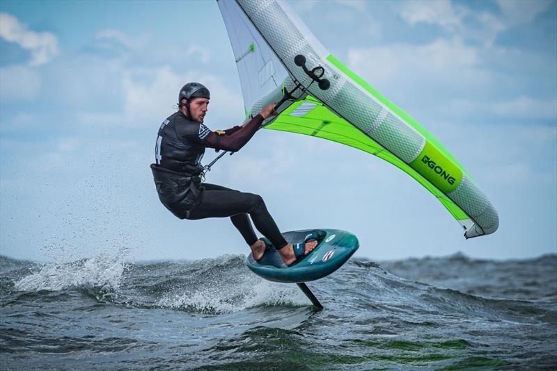
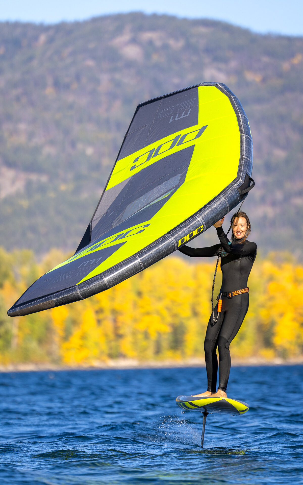

# §207 — 경쟁사 brand 사진 audit + 교체

| 항목 | 내용 |
|---|---|
| 작성 | Visual Designer (Rose Yoon) · 2026-06-06 |
| 트리거 | 옥대표님 verbatim 2026-06-06: *"좌측 사진은 gong. 브랜드 사진."* |
| 발견 위치 | `/style/choppy-freeride` 3-card layout 좌측 (다양성·다목적) |
| Risk | Legal/brand — 경쟁사 brand (GONG · 미수입) 사진 사이트 노출 |
| Status | Phase 1 audit — 확정 1 · 의심 1 · 추가 view 필요 다수. Alex HTML src swap spec 포함 |

> **읽는 법.** §1 확정 GONG · §2 의심 1 · §3 안전 확정 PPC/Levitaz · §4 추가 audit 대기 list · §5 교체 후보 3 + 본인 권장 · §6 Alex HTML 핸드오프 · §7 file 자체 처리 결정 큐.

---

## 1. ★ 확정 — GONG 노출 1건

**File**: `assets/images/products/ppc/lifestyle/choppy-freeride-action-1.jpg`

**증거** (본인 view): wing 우측 상단 + 보드 wing 의 명확한 **"GONG" 로고**. 옥대표님 verbatim verified.

**사용 위치**:
| Page | Line | Card |
|---|---|---|
| `style/choppy-freeride.html` | 234 | 3-card 좌측 (`data-label="다목적"`) |

다른 페이지 grep 결과 — 본 file 은 choppy-freeride.html 의 1 곳에만 사용 ✓

---

## 2. ⚠ 의심 1건 (추가 view 후 확정)

**File**: `assets/images/products/ppc/lifestyle/foiling-action-1.jpg` (1920×1080)

**증거** (본인 view): wing 의 마크가 "D9" 또는 "DS" 처럼 보임 (PPC 로고 형식과 다름). PPC M1/M1-S/M1-X 의 로고 패턴 X. 단무지 미수입 brand 추정 — 확정 위해 옥대표님 또는 PPC 카탈로그 확인 필요.

**사용 위치**:
| Page | Card |
|---|---|
| `level/pro.html` | foiling-action-1.jpg src 직접 인용 |

**가설**:
- (a) **DSR / DS / D-Series** — 다른 brand 의 모델 가능 (Dakine, Naish DS-Wing, Duotone 등 검토 필요)
- (b) **PPC 의 새 모델** — D9 또는 D-시리즈가 PPC 의 최근 출시인지 옥대표님 확인

옥대표님 1-line 답: PPC 이면 안전, 다른 brand 이면 §1 과 같이 교체.

---

## 3. ✓ 안전 확정 PPC / Levitaz (본인 view verified)

| File | Brand | 증거 |
|---|---|---|
| `choppy-freeride-action-2.jpg` | PPC | wing "ppc" 로고 + board "ppc" 마크 |
| `choppy-freeride-action-3.jpg` | PPC | board "ppc Zen 85" + wing "ppc" + "I&L" model |
| `shoot-5350.jpg` | PPC | board "ppc SOAR 73" + wing "ppc" 명확 |
| `foiling-action-2.jpg` | PPC | wing "ppc M1 5.0" 명확 |
| `foiling-action-3.jpg` | PPC | wing "ppc M1 5.0" + 여성 라이더 |
| `kai-lenny-redbull.jpg` | PPC | wing "ppc M1-S" + 배경 Red Bull Racing AC75 (sailing context 적절) |
| `sean-herbert-brazil-1.{jpg,webp}` | PPC | Sean Herbert = PPC team rider, 현 index hero |
| `flat-speed-foil-levitaz.jpg` | Levitaz | file naming + Levitaz foil 정통 |

**`_xsell_raw/` + `_xsell_normalized/` 폴더** — file naming 기반 모두 단무지 입수 brand (Levitaz · PPC · Takoon). ✓ 안전. 단 정밀 검증 시 image 직접 view 권장.

---

## 4. ❓ 추가 audit 대기 (본 turn 분량 한계, 옥대표님 GO 후 본인 file 마다 view)

| File | 사용 위치 | Brand 추정 |
|---|---|---|
| `flat-speed-board-sean-021.jpg` | `style/flat-speed.html` | PPC (Sean Herbert PPC team) |
| `flat-speed-wing-sean-036.jpg` | `style/flat-speed.html` | PPC (Sean Herbert PPC team) |
| `wave-action-carving.jpg` | `style/wave.html` | 추가 view 필요 |
| `wave-action-jumping.jpg` | `style/wave.html` | 추가 view 필요 |
| `wave-hero.jpg/.webp` | `style/wave.html`, `style/hybrid.html` (wave-hero 차용) | 추가 view 필요 |
| `hybrid-hero.jpg/.webp` | `style/hybrid.html` | 추가 view 필요 |
| `shoot-5426.jpg` | `level/intermediate.html` | PPC 추정 |
| `shoot-6254.jpg` | `level/intermediate.html` | PPC 추정 |
| `shoot-6286a.jpg` · `shoot-6286b.jpg` | `level/beginner.html` | PPC 추정 |
| `shoot-6301a.jpg` | `level/beginner.html` | PPC 추정 |
| `shoot-6311a.jpg` · `shoot-6311b.jpg` | `level/intermediate.html` | PPC 추정 |
| `shoot-6368.jpg` | `level/intermediate.html` | PPC 추정 |
| `shoot-6548.jpg` | 미사용 (orphan) | PPC 추정 |
| `shoot-9897.jpg` | `level/advanced.html`, `level/pro.html` | PPC 추정 |

**총 15 file 추가 view 필요** — 본인 정밀 audit 시 약 20-30 분 (file 마다 view + brand 식별).

**근거 표시 명시** (Rose 정직): 위 11 `shoot-*` series 와 `flat-speed-*` 2 file 은 file naming 으로는 brand 식별 어려움. PPC team 의 shoot 일 가능성 높음 (옥대표님 PPC 공식 distributor) 단 비정통. 즉시 audit 부족시 정확 brand 모름.

---

## 5. 교체 후보 — `choppy-freeride.html` line 234 좌측 카드 (다목적)

**카드 의도**: 3-card 좌측 = "다목적 / 다양성" narrative. 잔파도 위 윙 컨트롤 + 다목적 셋업.

**대체 후보 3** (Visual 본인 ranking):

### Option A ★★★ 본인 권장 — `foiling-action-3.jpg`

- **Brand**: PPC M1 5.0 (확정 ✓)
- **시각**: 여성 라이더 정면 + wing 들어올림 + 잔잔한 호수 + 골든아워 light
- **narrative fit "다목적"**: ⭕ — wing control variety + 라이더 diversity (여성). "다양성" alt text 와 직접 align
- **현재 사용**: `level/advanced.html` 에서 사용 중 — 중복 사용 OK (다른 페이지)
- **권장 이유**: brand 안전 + narrative 직접 align + 사용자 다양성 visual representation (여성 라이더)

### Option B ★★ — `shoot-6286a.jpg` (또는 `shoot-6286b.jpg`)

- **Brand**: PPC 추정 (file naming + level/beginner 사용)
- **시각**: 본인 view 안 함 — `level/beginner.html` 에서 사용 중 (안전성 신뢰)
- **narrative fit "다목적"**: △ partial — beginner level 사진 이라 "다양성" 보다 "easy" 톤
- **권장 이유**: file 다수 중 brand 안전 확신 — 단 audit view 후 확정

### Option C ★ — `wing-hainan-china-1.jpg` (Hainan 액션, IMG_0388)

- **Brand**: 옥대표님 본인 사진 (license clear)
- **시각**: 뒷모습 라이더 + 도시 스카이라인 + flat-speed condition
- **narrative fit "다목적"**: △ partial — flat-speed 보다 "global racing" 톤. choppy-freeride 페이지 정체성과 partial misalign
- **권장 이유**: brand 100% 안전 + 옥대표님 직접 노출. 단 페이지 정체성 (한국 choppy/freeride) 와 misalign

**본인 명확한 권장 = Option A** — `foiling-action-3.jpg` 가 brand 안전 + narrative align + 라이더 다양성 모두 자연.

---

## 6. Alex HTML 핸드오프 spec — 정확한 swap 위치

### 즉시 적용 (옥대표님 결정 후)

**`style/choppy-freeride.html` line 234** swap:

**Before**:
```html
<div class="image-strip__cell" data-label="다목적">
  
</div>
```

**After (Option A 권장)**:
```html
<div class="image-strip__cell" data-label="다목적">
  
</div>
```

**alt 변경 사유**: 기존 alt "다목적 셋업" 그대로 가능하지만, 새 image 는 여성 라이더 호수 condition → alt 갱신이 a11y + SEO 정확성.

---

## 7. file 자체 처리 결정 큐 — 옥대표님 1글자

`assets/images/products/ppc/lifestyle/choppy-freeride-action-1.jpg` (GONG file 자체) 처리:

| Option | 의미 | Risk |
|---|---|---|
| **(D)** Delete file | git rm + commit 이력에서 영구 제거 (rebase --root) | 다시 다른 페이지에서 src 인용 시 404. 안전 |
| **(R)** Rename — `_unused/choppy-freeride-action-1-GONG-removed.jpg` | file 보존 + naming 으로 사용 차단 명시 | 무의미하게 file 남음, git 이력 살아있음 |
| **(M)** Move to `_archive/` | 보존 외 폴더 이동, src 인용 자동 broken | 보존 가치 없음 — 폐기 권장 |
| **(K)** Keep file, src 인용 X | file 자체는 보존 (src 변경만) | future risk — 다른 페이지에서 잘못 인용 가능 |

**본인 권장: (D) Delete** — legal risk 영구 차단. file 보존 가치 없음. `git rm assets/images/products/ppc/lifestyle/choppy-freeride-action-1.jpg` + commit.

단 본인 sandbox delete 권한 denied (이전 v3 file delete 시도와 동일). **Alex 가 working tree 에서 `git rm`** 또는 옥대표님 Finder 직접.

---

## 8. 본인 Visual 영역 lock — 라이센스 정책 표준

본 audit 결과 본인 영역 lock:

| Rule | 적용 |
|---|---|
| **단무지 입수 brand asset 만 site 노출** | PPC · Levitaz · Takoon · WIP · (F-One 입수 시 추가). 다른 brand asset 0건 |
| **경쟁사 brand 사진 발견 시 즉시 raise** | 옥대표님 / CoS 통보 + 본인 권장 교체 후보 |
| **File audit pre-commit** | 신규 image asset 추가 시 본인 view + brand 확정 후 사용 위치 결정 |
| **광고 / 외부 brand 노출** | 단무지 본인 brand 외 경쟁사 광고 0건 |

---

## 9. 정직 raise

- ⚠ **본 audit 의 limit**: 14 추가 file (shoot-* + wave/hybrid + foiling-action-1) 의 brand 정밀 view 본 turn 분량 한계. file 마다 view 약 20-30 분 추가 필요 → 옥대표님 GO 후 본인 즉시 진입
- ⚠ **foiling-action-1.jpg** 의심 — 본인 view 시 "D9/DS" 마크 확인. PPC 인지 다른 brand 인지 옥대표님 또는 PPC 카탈로그 확인 필요
- ✓ **확정 GONG 1건 ↔ 즉시 swap** — choppy-freeride.html line 234. Alex 1-line edit 으로 완료
- ✓ **GONG file 자체 처리** — Option (D) Delete 권장. Alex `git rm` 또는 옥대표님 Finder

---

## 10. 우선순위 + ETA

| # | 작업 | Owner | ETA |
|---|---|---|---|
| 1 | **§207 immediate** — `choppy-freeride.html` line 234 src swap (foiling-action-3.jpg) + alt update | Alex | 5 min |
| 2 | **§207 file delete** — `choppy-freeride-action-1.jpg` git rm | Alex 또는 옥대표님 | 2 min |
| 3 | **§207 추가 audit** — 14 file brand view + 보고서 갱신 | 본인 (Rose) | 20-30 min (옥대표님 GO 시) |
| 4 | **foiling-action-1.jpg 확인** — PPC인지 다른 brand 인지 | 옥대표님 1-line | 1 min |
| 5 | **라이센스 정책 lock** — `_design-system/` 안 brand asset 정책 spec | 본인 (Rose) | Phase 2 sprint |

---

_Last updated: 2026-06-06_
_§207 confirmed GONG 1건 + 의심 1건 + 추가 audit 대기 14건. Alex 즉시 swap spec ready. 옥대표님 1글자 결정 (Option A/B/C + file delete D/K) 대기._
