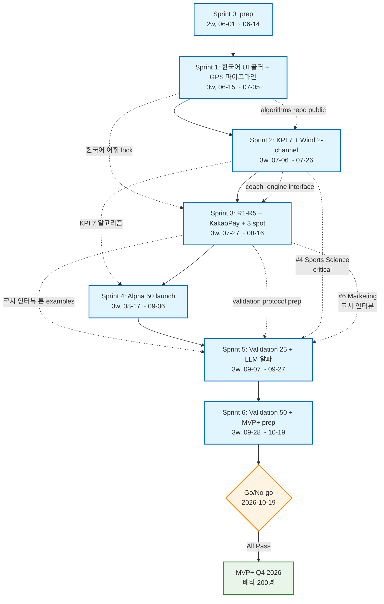

# SailTechCo Phase 1 MVP — Sprint 실행 계획 (Q3-Q4 2026)

| 항목 | 내용 |
|---|---|
| 문서 버전 | v1.0 |
| 작성일 | 2026-05-28 |
| 상위 reference | `sailtechco_moat_proposal.md` v1.0 (북극성 문서) |
| 대상 단계 | Phase 1 MVP (Q3 2026 알파 50명 → Q4 2026 베타 200명) |
| 계획 horizon | 6 sprint × 3 week = 18 week (2026-06-15 ~ 2026-10-19) + 8 week MVP+ 안정화 (2026-10-20 ~ 2026-12-14) |
| 책임자 | Danny (1 founder) + 11-expert fleet (8 도메인 + 3 인프라) + AI 자동화 + 가변 외주 (≤0.3 FTE) |
| 검수 기준 | 모든 일정 = honest estimate (낙관적 X). DoD = 검증 가능 산출물. 의존성 = 명시. 위험 = 정량 mitigation. |

> **이 문서의 위치.** 북극성 문서 §5 의 Q3-Q4 2026 MVP 단계를 *sprint 단위 실행 계획* 으로 분해. §7 (1-page deck) 의 "Phase 1 funding ask = 12개월 capacity for 1 founder + 1 freelance" 가 sprint 단위로 어떻게 소화되는지를 본 문서가 명시. 모든 후속 일일 작업 의사결정의 reference.

> **읽는 방법.** §1 = 6 sprint 의 goal·task·DoD·검증. §2 = 의존성 그래프 (mermaid). §3 = critical path (최단 일정). §4 = 11-expert resource allocation. §5 = sprint 별 위험과 mitigation. §6 = 알파 100명 모집 plan. §7 = Go/No-go criteria (MVP 출시 조건).

---

## §0. 핵심 수치 요약

| 항목 | 수치 |
|---|---|
| Sprint 수 | 6 × 3 week = **18 week** |
| Sprint 0 prep (kick-off) | 2 week (2026-06-01 ~ 2026-06-14) |
| Sprint 1 시작 | **2026-06-15** |
| Sprint 6 종료 | **2026-10-19** |
| 알파 50명 launch (target) | **Sprint 4 말 = 2026-09-07** |
| 베타 200명 launch (target) | **MVP+ 종료 = 2026-12-14** |
| 5 wedge 산출물 | W1 한국어 UI 100% / W2 KPI 7 / W3 wind MAE <15° / W4 GitHub Apache 2.0 + methodology v0.1 / W5 R1-R5 |
| Critical path 길이 | **16 week** (Sprint 1 W1 → Sprint 6 KPI validation 완료) — §3 참조 |
| 1-인 founder capacity | ≈ 120-140h / sprint (가용 시간 70%, sprint planning/admin 30%) |
| AI 자동화 multiplier | 콘텐츠·boilerplate·문서 = 1.5-2x. 알고리즘 design/검증 = 1.1-1.3x |
| 외주 budget | ≤ 0.3 FTE (sprint 당 ≈ 36h) for 디자인 / 영상 / 코치 인터뷰 |

---

## §1. Sprint 1-6 Detail Breakdown

각 sprint = **목표 (deliverable) · 작업 list (0.5-3일) · 책임 expert (#1~#11) · 의존성 · DoD · 검증**.

### Sprint 0 (Prep, 2 week — 2026-06-01 ~ 2026-06-14)

**목표:** 개발 환경 + brand 기반 + 도메인 인터뷰 사전 작업 완료.

| 작업 | 책임 | 의존성 | 소요 (일) |
|---|---|---|---|
| GitHub org 생성 (`sailtechco`) + Apache 2.0 LICENSE 초안 + repo skeleton (algorithms / docs / tests / site) | #11 Dashboard + Danny | — | 1 |
| 도메인 등록 (sailtechco.kr, sailtechco.com) + 이메일 (founder@) | Danny | — | 0.5 |
| 한국 윙포일 코치 인터뷰 contact 리스트 (송정·강릉·양양 클럽장 5 인) — Marketing 사전 작업 | #6 Marketing | — | 2 |
| Brand baseline (logo wordmark, primary color, typography 1차) — Visual prep | #1 Visual | — | 2 |
| Sprint backlog 도구 (Linear / Notion / GitHub Projects) 결정 + 6-sprint backlog import | Danny | — | 0.5 |
| Dev 환경 (Xcode / Android Studio / Node / Python) + CI (GitHub Actions) 1차 | #5 Frontend + #7 Mobile | — | 1 |
| 한국 윙포일 인구 quick verify (네이버 카페 회원수 · 인스타 hashtag 게시물 수 spot check) — 북극성 §6.2 미해결 질문 #1 | #6 Marketing | — | 1 |
| Sprint 0 검수 회의 (Danny self-review + DoD checklist) | Danny | 위 7 작업 완료 | 0.5 |

**Sprint 0 DoD:** GitHub org 생성 완료 / 한국 윙포일 코치 5인 contact 확보 / brand 1차 / 도메인 + 이메일 / CI 작동. **검증:** GitHub repo URL push 성공 + 코치 5인 contact 확인 메일 + brand spec 1-pager.

---

### Sprint 1 (W1-3, 2026-06-15 ~ 2026-07-05) — 한국어 UI 골격 + 데이터 모델

**목표:** 한국어 100% UI shell + 세션 데이터 모델 + GPS 수집 파이프라인 (iOS Phase 1).

> **5-wedge 진행:** W1 한국어 UI 골격 60% / W2 데이터 모델 설계 / W3 prep (GPS source) / W4 GitHub repo public / W5 prep (룰엔진 인터페이스 설계)

| 작업 | 책임 | 의존성 | 소요 (일) |
|---|---|---|---|
| iOS app skeleton (SwiftUI, 최소 화면 = onboarding / session / history) | #7 Mobile | Sprint 0 dev env | 3 |
| Session 데이터 스키마 정의 (`Session`, `GPSFix`, `Maneuver`, `WindEstimate`, `KPIBundle`) — JSON Schema + Pydantic | #9 Backend + #4 Sports Science | — | 2 |
| GPS 수집 파이프라인 (1Hz lat/lng/speed/COG/accuracy, foreground+background) — iOS CoreLocation | #7 Mobile | iOS skeleton | 2 |
| Session 저장소 (SQLite + cloud sync 인터페이스만; 실제 sync = Sprint 4) | #9 Backend | 데이터 스키마 | 2 |
| 한국어 UI 1차 (windfoil 도메인 어휘 lock — 자이브/택/풋스트랩/푸셀라지 등 30개 term 표준화) | #3 UX + Danny (도메인) | brand baseline | 1.5 |
| Wireframe 7개 화면 (홈 · 세션 시작 · 세션 진행 · 세션 결과 · KPI 상세 · 코치 코멘트 · 설정) | #3 UX + #1 Visual | 한국어 용어 lock | 2 |
| KPI 카드 컴포넌트 SwiftUI (Top Speed / Avg / Foiling Time / Distance / Duration — 5종 1차 디스플레이) | #2 DataViz + #7 Mobile | 데이터 스키마 + UI 어휘 | 2 |
| GitHub repo first commit + Apache 2.0 LICENSE + README.md (KO + EN) + CONTRIBUTING.md | #11 Dashboard | Sprint 0 org | 1 |
| 룰엔진 인터페이스 설계 doc (`coach_engine/RULES.md` — R1-R5 input/output schema) | #4 Sports Science | — | 1.5 |
| Sprint 1 검수 (TestFlight build + UI screenshot review + 코드 PR 머지 5건+) | Danny + #1 Visual + #3 UX | 위 모두 | 1 |

**Sprint 1 DoD:**
- iOS TestFlight build 작동 (Danny 본인 폰 설치 가능)
- 첫 세션 raw GPS 수집 → 저장 → 화면에 5개 KPI 표시
- GitHub repo public (Apache 2.0) + 첫 PR 5건+ 머지
- 한국어 윙포일 도메인 어휘 30개 lock

**검증:** Danny 본인이 다대포에서 1세션 (30분) 기록 + 5개 KPI 화면 캡처 — 모든 숫자 plausible.

---

### Sprint 2 (W4-6, 2026-07-06 ~ 2026-07-26) — KPI 엔진 + Wind 2-channel inference

**목표:** Phase 1 KPI 7개 산출 + Wind 2-channel inference (Channel A 사용자 1회 캡처 + Channel D 외부 weather).

> **5-wedge 진행:** W2 KPI 7 알고리즘 완성 / W3 2-channel wind 1차 / W4 algorithms/ 모듈 첫 공개 / W5 prep (룰엔진 R1 구현)

| 작업 | 책임 | 의존성 | 소요 (일) |
|---|---|---|---|
| Maneuver detection (heading change >60° 자동 검출) Python 알고리즘 + iOS Swift 포팅 | #4 Sports Science + #10 Daemon | Sprint 1 데이터 스키마 | 3 |
| KPI 7 산출 함수 (`top_speed_2s`, `avg_speed`, `foiling_time_threshold`, `jibe_count`, `distance`, `session_duration`, `wind_direction`) — Python + iOS Swift | #4 Sports Science + #10 Daemon | maneuver detection | 3 |
| Channel A 구현 — 사용자 1회 풍향 캡처 UI (port/starboard upwind heading 2회 입력 → 이등분) | #7 Mobile + #3 UX | wireframe Sprint 1 | 1.5 |
| Channel D 구현 — OpenWeather Time Machine API + KMA RDAPS GRIB fetch (한국 spot 한정) | #9 Backend + #10 Daemon | — | 2 |
| Bayesian weighted combine (2-channel, Channel B/C placeholder; circular mean) + confidence 산출 | #4 Sports Science + #10 Daemon | Channel A + D | 2 |
| Confidence 한국어 reasoning template (높음/보통/낮음 각 3-5 문구) | #3 UX + Danny | combine 산출 | 1 |
| algorithms/ 모듈 PR (`wind_inference/`, `maneuver_detection/`, `kpi_catalog/`) — 의사코드 주석 + 단위 테스트 50%+ | #11 Dashboard | KPI + wind 산출 | 2 |
| Unit test suite (synthetic GPS track 5개 = upwind / downwind / reaching / mixed / edge) | #10 Daemon | KPI + maneuver | 2 |
| Sprint 2 검수 — Danny 본인 3 세션 (송정/강릉 가능 시) recording → 7 KPI + wind 표시 정확도 spot check | Danny + #4 Sports Science | 위 모두 | 1 |

**Sprint 2 DoD:**
- 7 KPI 모두 산출 + 화면 표시
- Wind 2-channel inference 작동 (confidence 한국어 표기 포함)
- algorithms/ public PR 머지 (코드 + 테스트 + 의사코드 주석)
- 한국어 confidence reasoning 9 문구+ 작성

**검증:** Danny 3개 세션 데이터를 (i) Waterspeed 와 wind direction 평행 비교 (ii) 알고리즘 unit test 50%+ pass — 두 검증 모두 충족.

---

### Sprint 3 (W7-9, 2026-07-27 ~ 2026-08-16) — 옥코치 R1-R5 + KakaoPay 베타 + Spot 1차

**목표:** R1-R5 룰엔진 + 정적 한국어 코치 template + KakaoPay 베타 결제 + 송정·강릉·양양 spot 가이드.

> **5-wedge 진행:** W1 KakaoPay 베타 + 3 spot guide / W4 R1-R5 코드 공개 / W5 R1-R5 룰엔진 + 정적 한국어 template 15-30 문구

| 작업 | 책임 | 의존성 | 소요 (일) |
|---|---|---|---|
| R1 진입 비대칭 구현 (Python + iOS Swift) + 단위 테스트 | #4 Sports Science + #10 Daemon | Sprint 2 maneuver detection | 1.5 |
| R2 회전 회복 시간 구현 | #4 Sports Science | maneuver | 1 |
| R3 2단 회전 구현 (heading rate peak detection) | #4 Sports Science | maneuver | 1.5 |
| R4 진입 손실 구현 (jibe 진입 직전 속도 dip) | #4 Sports Science | KPI top_speed | 1 |
| R5 출구 가속 구현 (jibe 출구 후 가속 angle) | #4 Sports Science | KPI top_speed | 1 |
| R1-R5 출력 → 한국어 정적 template 18 문구 (severity high/medium 각 2-3 + 격려 문구 6) | #3 UX + Danny + 코치 자문 | R1-R5 산출 | 2 |
| KakaoPay 베타 결제 통합 (KakaoPay Developers API) — sandbox + 실제 결제 1회 검증 | #9 Backend + #7 Mobile | — | 2.5 |
| KRW 가격 표기 + 부가세 표기 (free + Pro ₩5,000/월 — 결제 흐름만, paywall 은 Sprint 5) | #7 Mobile | KakaoPay 통합 | 1 |
| 송정 spot 가이드 markdown (수심·풍향·조류·해수 온도·주차·세팅·식당) + 사진 3장 | #6 Marketing + Danny (현지 답사) | brand baseline | 1.5 |
| 강릉(사천진) spot 가이드 — 동일 포맷 | #6 Marketing | 송정 가이드 템플릿 | 1.5 |
| 양양 spot 가이드 — 동일 포맷 | #6 Marketing | 송정 가이드 템플릿 | 1.5 |
| Spot KMA wind overlay (3 spot 의 1.5km RDAPS station 매핑 — 실시간 wind dot) | #2 DataViz + #9 Backend | Channel D Sprint 2 | 2 |
| Coach engine PR (`coach_engine/rule_r1_*.py` ~ `rule_r5_*.py`) + 의사코드 주석 | #11 Dashboard | R1-R5 산출 | 1 |
| 한국 윙포일 코치 인터뷰 k=10 (송정 4 / 강릉 3 / 양양 3) — 톤 examples 수집 (Sprint 4-5 LLM 준비) | #6 Marketing + Danny | Sprint 0 contact | 3 |
| Sprint 3 검수 — KakaoPay 실제 결제 1회 + R1-R5 출력 + spot 가이드 3개 publish | Danny + #4 Sports Science | 위 모두 | 1 |

**Sprint 3 DoD:**
- R1-R5 모두 산출 + 정적 한국어 template 18 문구
- KakaoPay 베타 실제 결제 1회 성공
- 3 spot 가이드 publish (markdown + 사진)
- 코치 인터뷰 10인 transcribe 완료 → 톤 examples DB 1차

**검증:** Danny 본인이 송정 1세션 → 자이브 5회 detection → R1-R5 출력 → 한국어 template 15개 중 5개 자연스럽게 매칭. KakaoPay ₩100 결제 (테스트) 성공.

---

### Sprint 4 (W10-12, 2026-08-17 ~ 2026-09-06) — Alpha 50명 launch readiness

**목표:** 알파 50명 launch 인프라 + 콘텐츠 + 분석 dashboard + 1차 launch.

> **5-wedge 진행:** W1 한국어 UI 90% + KakaoPay 베타 + 3 spot / W2 KPI 7 launch / W3 2-channel launch / W4 GitHub repo first formal release v0.1.0 + methodology doc v0.1 / W5 R1-R5 + 정적 template launch

| 작업 | 책임 | 의존성 | 소요 (일) |
|---|---|---|---|
| Backend production 인프라 (Cloudflare Pages + Workers + D1 또는 Supabase) — session sync 작동 | #9 Backend | Sprint 1 storage | 2.5 |
| 알파 사용자 onboarding flow (카카오 OAuth + 동의 + 첫 세션 가이드 + 1회 풍향 캡처 튜토리얼) | #3 UX + #7 Mobile | Channel A | 2 |
| Admin dashboard (사용자 수 · DAU · 세션 수 · KPI 분포 · wind confidence 분포 · crash log) — internal use | #11 Dashboard + #2 DataViz | Backend prod | 2 |
| TestFlight 외부 베타 → App Store internal track 전환 (50 인원) | #7 Mobile | iOS app ready | 1.5 |
| Methodology doc v0.1 작성 (4-channel wind inference 의 Channel A+D 분량 + KPI 7 measurement + R1-R5 rule definitions) — 한국어 1차 + 영어 abstract | Danny + #4 Sports Science | algorithms 모듈 | 3 |
| GitHub release v0.1.0 tag + CHANGELOG.md + 소셜 announcement 초안 (트위터/X · 인스타 · 네이버 카페 · LinkedIn) | #11 Dashboard + #6 Marketing | methodology v0.1 | 1 |
| 한국 윙포일 사용자 모집 콘텐츠 — 블로그 2편 ("왜 윙포일 분석 앱이 한국에는 없었나" + "SailTechCo 알파 신청 안내") | #6 Marketing + Danny | brand + spot 가이드 | 2 |
| 네이버 카페 + 카카오톡 오픈채팅 announcement (한국 윙포일 카페 운영진과 사전 협의) | #6 Marketing | 블로그 publish | 1 |
| 인스타 릴스 30초 데모 영상 1편 (Danny 자이브 분석 → 코치 코멘트 표시) | #6 Marketing + Danny | KPI + coach 출력 | 2 |
| 알파 50명 모집 form (Google Form 또는 자체) + 응답 자동 처리 워크플로우 | #11 Dashboard + #6 Marketing | 블로그 publish | 1 |
| Critical bug 수정 + crash-free rate ≥ 99% 목표 (실제 사용자 2-3명 사전 dogfood) | #7 Mobile + Danny | TestFlight | 2 |
| **Alpha launch 2026-09-07** — 50명 초대 발송 + 첫 세션 사용자 모니터링 시작 | Danny + #6 Marketing + #11 Dashboard | 위 모두 | 0.5 |

**Sprint 4 DoD:**
- Backend production 작동 (session sync 정상)
- TestFlight 외부 베타 50석 채워짐 (모집 form 응답 60+ → 50 선발)
- Methodology doc v0.1 publish (GitHub `docs/methodology/`)
- GitHub release v0.1.0 tag + CHANGELOG
- 블로그 2편 publish (한국어)
- Crash-free rate ≥ 99%
- **알파 50명 첫 세션 5+ 명 실제 기록 완료**

**검증:** Alpha launch 후 72시간 내 (i) 5명 이상 첫 세션 기록 (ii) crash 신고 0건 (iii) admin dashboard 가 모든 세션 visible.

---

### Sprint 5 (W13-15, 2026-09-07 ~ 2026-09-27) — Alpha 검증 + LLM 코치 알파 + KPI validation

**목표:** Alpha 사용자 데이터 기반 KPI validation 시작 + LLM 자연어 코치 알파 + 사용자 retention 측정.

> **5-wedge 진행:** W2 KPI 7 validation 시작 (in-water 카메라 비교 25 세션) / W3 wind MAE 측정 (50 세션) / W5 LLM (Claude API) 자연어 변환 알파

| 작업 | 책임 | 의존성 | 소요 (일) |
|---|---|---|---|
| In-water 카메라 validation protocol 작성 (GoPro chest mount + GPS reference + Vakaros borrowed unit + wind sensor 비교 방법) | #4 Sports Science + #8 Hardware | methodology v0.1 | 2 |
| Validation 세션 25 회 실시 (Danny + 알파 사용자 5명 협조 — 송정 15 / 강릉 5 / 양양 5) | #4 Sports Science + Danny + 알파 5인 | protocol | 5 (분산) |
| KPI 정확도 측정 (top_speed MAE · jibe_count precision · foiling_time threshold validation) | #4 Sports Science + #10 Daemon | 25 세션 raw | 2.5 |
| Wind MAE 측정 (Channel A+D combined vs GoPro+wind sensor reference) — 목표 <15° | #4 Sports Science | 25 세션 raw | 2 |
| LLM 코치 prompt engineering (송정 코치 톤 system prompt + R1-R5 input → 자연어 출력) | Danny + #3 UX | 코치 인터뷰 10인 | 2 |
| Claude API 통합 (iOS app → 자체 backend → Claude API → 한국어 응답 반환) | #9 Backend + #7 Mobile | LLM prompt | 2 |
| LLM 코치 알파 — 알파 50명 중 옵트인 25명에게 LLM 코멘트 활성화, 정적 template 과 A/B | #7 Mobile + #6 Marketing | Claude API 통합 | 1.5 |
| 코치 naturalness 평가 — 한국 윙포일 코치 5명에게 blind LLM 코멘트 30개 평가 (Likert 1-5) | #6 Marketing + #4 Sports Science | LLM 출력 30개 | 2 |
| 알파 사용자 인터뷰 5명 (사용 경험 · NPS · 가장 좋았던 KPI · 어색한 한국어) | #6 Marketing + #3 UX | 알파 1주 후 | 2 |
| Crash · bug 핫픽스 (알파 사용자 신고 반영) | #7 Mobile + Danny | 알파 신고 | 2 |
| 알파 1차 retention 측정 (7d / 14d active) + dashboard 위젯 | #11 Dashboard | admin dashboard | 1 |
| 한국어 블로그 2편 (algorithm 공개 1편 + 알파 1주 회고 1편) | #6 Marketing + Danny | validation 1차 | 2 |

**Sprint 5 DoD:**
- Validation 25 세션 완료 + KPI 7 정확도 1차 측정
- Wind MAE 측정값 보고 (<15° 달성 여부 명시)
- LLM 코치 알파 25명 활성화 + 한국 코치 5명 naturalness 평가 (목표 ≥ 4.0/5)
- 알파 사용자 인터뷰 5명 transcript
- 알파 7일 retention 측정값 보고

**검증:** Validation 결과 publish (GitHub `docs/validation/2026-09_alpha_results.md`) — 모든 측정값 + ground truth + limitation 정직 표기.

---

### Sprint 6 (W16-18, 2026-09-28 ~ 2026-10-19) — MVP+ 확장 + KPI validation 마무리 + 200명 모집 준비

**목표:** Validation 데이터 기반 KPI 수치 calibration + 콘텐츠 확장 + 베타 200명 모집 준비.

> **5-wedge 진행:** W1 UI 100% + 네이버페이/토스 추가 + 콘텐츠 5편 / W2 KPI 7 validation 완료 / W3 wind MAE 최종 보고 / W4 methodology doc v0.2 / W5 LLM 코치 GA 1차

| 작업 | 책임 | 의존성 | 소요 (일) |
|---|---|---|---|
| Validation 세션 추가 25회 → 누적 50회 + KPI calibration 최종값 (foiling time threshold 등) | #4 Sports Science + Danny + 알파 | Sprint 5 protocol | 4 (분산) |
| Wind MAE 최종 보고 (50 세션 기반) + confidence calibration 검증 (높음 표시 → 실제 정확도) | #4 Sports Science | 50 세션 | 2 |
| LLM 코치 GA 1차 (알파 50명 전체 활성화, 옵트인 default) + cost monitoring | #7 Mobile + #9 Backend | Sprint 5 알파 | 1.5 |
| 네이버페이 + 토스페이먼츠 통합 추가 (KakaoPay 옆) | #9 Backend + #7 Mobile | KakaoPay | 2 |
| 한국어 UI 100% 완성 (Sprint 1-4 에서 누락된 텍스트 audit + 정정) | #3 UX + Danny | — | 1.5 |
| 한국어 블로그 3편 (KPI 측정 방법 공개 1편 + 송정 윙포일 가이드 1편 + 알파 4주 회고 1편) | #6 Marketing + Danny | — | 3 |
| Methodology doc v0.2 (Sprint 5 validation 결과 통합 + R1-R5 measurement methodology + KPI ground truth comparison) | Danny + #4 Sports Science | validation 완료 | 2 |
| Spot 가이드 2개 추가 (다대포 + 시화호 — 북극성 §W1.3 5-spot 1차 list 완성) | #6 Marketing | 송정 템플릿 | 2 |
| GitHub release v0.2.0 + CHANGELOG + announcement | #11 Dashboard | methodology v0.2 | 1 |
| 베타 200명 모집 form publish + 알파 50명 referral 인센티브 (친구 추천 → Pro 1개월 무료) | #6 Marketing | LLM 코치 GA | 1 |
| 인스타 릴스 3편 (자이브 3종 — 잘된 / 어색 / 회복 — 각 30초) | #6 Marketing + Danny | — | 3 |
| App Store 정식 출시 준비 (스크린샷 5종 · 설명문 한국어 + 영어 · 카테고리 = 스포츠) | #1 Visual + #6 Marketing + #7 Mobile | UI 100% | 2 |
| Sprint 6 검수 + MVP Go/No-go 회의 (§7 criteria) | Danny + Fleet 전체 | 위 모두 | 0.5 |

**Sprint 6 DoD:**
- Validation 50 세션 완료 + KPI 7 + Wind MAE 최종 보고
- Methodology doc v0.2 publish
- 네이버페이 + 토스 통합 완료 → 3 PG 옵션 작동
- LLM 코치 GA (50명 전체) + cost <$5/주
- 5 spot 가이드 publish
- 한국어 블로그 누적 5편 publish
- 베타 200명 모집 form 오픈
- App Store 정식 출시 자료 준비 완료

**검증:** Go/No-go 회의 (§7) 에서 모든 기준 통과 → MVP+ 단계 (Q4 2026 = 2026-10-20 ~ 2026-12-14) 진입.

---

### MVP+ (Sprint 7-9 equivalent, Q4 2026 = 8 week, 2026-10-20 ~ 2026-12-14) — 베타 200명 확장 (개략)

> 본 문서의 1차 scope 는 Sprint 1-6. MVP+ 는 §7 Go/No-go 통과 후 별도 v1.1 plan 으로 분리. 개략 backlog 만 명시.

- App Store 정식 출시 (한국 region)
- 베타 200명 launch (알파 50 + 신규 150)
- LLM 코치 사용자 진보 단계 인지 (초·중·고급) 1차
- 추가 KPI validation (foiling time 정확도 ≥ 90% 달성)
- 한국어 콘텐츠 누적 12편 (블로그 7편 + 유튜브 5편)
- KakaoTalk 오픈채팅 라이더 직접 응대 시작
- v1 (Q1 2027) Apple Watch IMU 알파 준비

---

## §2. 의존성 Graph (mermaid)



### §2.1 핵심 의존성 정리

**Strict 선행 (앞 sprint 끝나야 시작 가능):**
- Sprint 1 → Sprint 2: 데이터 스키마 + GPS 파이프라인 없이는 KPI/wind 알고리즘 불가
- Sprint 2 → Sprint 4: KPI 7 산출 없이는 알파 launch 무의미
- Sprint 3 → Sprint 5: 코치 인터뷰 톤 examples 없이는 LLM prompt engineering 불가
- Sprint 4 → Sprint 5: 알파 사용자 없이는 validation 25 세션 수집 불가
- Sprint 5 → Sprint 6: validation 1차 결과 없이는 calibration / methodology v0.2 불가

**Soft 선행 (앞 sprint 산출물 가공하면 시작 가능, 일부 병렬 가능):**
- Sprint 1 한국어 어휘 lock → Sprint 3 spot 가이드 (가이드 작성은 어휘 lock 완료 후)
- Sprint 2 algorithms repo public → Sprint 4 methodology doc v0.1 (코드 reference 필요)

**병렬 가능 (sprint 내):**
- KPI 산출 (#4 + #10) + Wind inference (#4 + #10) — Sprint 2 동시 진행 가능 (동일 expert 라 시간 분배만 필요)
- Spot 가이드 작성 (#6) + KakaoPay 통합 (#9) — Sprint 3 완전 병렬
- Validation 세션 실시 (#4 + Danny) + LLM 코치 algorithm (Danny + #3) — Sprint 5 시간대 다르면 병렬 가능
- 블로그 작성 (#6) + iOS UI 폴리시 (#7) — 모든 sprint 병렬 가능

---

## §3. Critical Path

### §3.1 가장 긴 경로 (Critical Path Method)

**Sprint 의존성 sequential 합산:**

```
Sprint 0 (2w) → Sprint 1 (3w) → Sprint 2 (3w) → Sprint 3 (3w) → Sprint 4 (3w)
                                                 ↓
                                          Alpha launch (Sprint 4 말)
                                                 ↓
                                          Sprint 5 (3w) → Sprint 6 (3w) → Go/No-go

Total: 2 + 3+3+3+3+3+3 = 20 weeks (Sprint 0 포함)
```

**Sprint 0 prep 를 별도 두면 Sprint 1-6 = 18 weeks.** Sprint 0 는 일부 작업 (도메인 등록 등) 이 Sprint 1 과 병렬 가능 → 실효 critical path = **18 weeks**.

### §3.2 Critical path 안의 가장 위험한 link

**🔴 가장 큰 risk = Sprint 4 → Sprint 5 의 알파 사용자 모집 + 활성화:**
- Sprint 5 의 validation 25 세션 수집은 알파 사용자 5명+ 협조 필수
- 알파 사용자 활성화율 < 50% 시 25 세션 수집 불가 → Sprint 5 validation 지연
- Mitigation: Sprint 4 모집 form 응답 100+ → 50 선발 (2배 buffer) + 첫 세션 가이드 강화

**🟡 두 번째 risk = Sprint 2 → Sprint 3 의 알고리즘 정확도:**
- KPI 7 + wind inference 의 unit test pass 율이 낮으면 (예: 50% 미만) Sprint 3 R1-R5 가 잘못된 KPI 위에서 작동
- Mitigation: Sprint 2 마지막 1일 = 알고리즘 spot check (Danny 본인 3 세션) + critical bug fix buffer

### §3.3 MVP 출시 최단 일정

| 시나리오 | 일정 |
|---|---|
| **Optimistic** (모든 sprint on-time, 0 bug, 알파 5명 활성화 5+ ) | Alpha 50명 = **2026-09-07** / MVP+ = **2026-10-19** |
| **Honest** (sprint 평균 0.5 week slippage, bug fix 1 week, 알파 활성화 80%) | Alpha 50명 = **2026-09-14** (1주 지연) / MVP+ = **2026-11-02** (2주 지연) |
| **Conservative** (sprint 평균 1 week slippage, critical bug 1 sprint, 알파 활성화 50%) | Alpha 50명 = **2026-10-05** (4주 지연) / MVP+ = **2026-12-14** (8주 지연) |

→ **Honest 시나리오를 base case 로 사용** (북극성 §6.2 미해결 질문 + 1인 개발 capacity 의 현실 반영).

→ **베타 200명 launch = 2026-11-02 (honest) ~ 2026-12-14 (conservative)** — Q4 2026 안에 달성 가능 범위.

---

## §4. Resource Allocation Table

### §4.1 11-expert fleet 시간 분배 (sprint 당 일 단위)

| # | Expert | S0 | S1 | S2 | S3 | S4 | S5 | S6 | 합계 (일) | AI 자동화 가능 영역 |
|---|---|---|---|---|---|---|---|---|---|---|
| #1 | Visual (UI 디자인) | 2 | 0 | 0 | 0 | 1 | 0 | 1 | **4** | 로고 variations, 컬러 palette 추출 |
| #2 | DataViz (차트·KPI 디스플레이) | 0 | 2 | 0 | 0 | 1 | 0 | 0 | **3** | 차트 라이브러리 선택, mock data 생성 |
| #3 | UX (정보 구조·flow) | 0 | 4 | 1 | 1 | 1 | 2 | 1 | **10** | wireframe 텍스트, 한국어 microcopy 1차 |
| #4 | Sports Science (도메인·검증) | 0 | 2 | 6 | 5 | 0 | 7 | 5 | **25** | KPI 산출 코드 generate, validation 통계 분석 |
| #5 | Frontend (web) | 1 | 0 | 0 | 0 | 0 | 0 | 0 | **1** | site landing page (low priority Phase 1) |
| #6 | Marketing (콘텐츠·캠페인·동호회) | 2 | 0 | 0 | 5 | 6 | 4 | 5 | **22** | 블로그 초안, 인스타 캡션, 카페 공지 초안 |
| #7 | Mobile (iOS / Apple Watch) | 1 | 7 | 2 | 4 | 5 | 3 | 3 | **25** | boilerplate Swift code, SwiftUI 컴포넌트 |
| #8 | Hardware (Phase 2 영역, prep 만) | 0 | 0 | 0 | 0 | 0 | 1 | 0 | **1** | (Phase 2 BLE / external sensor — v1 이후) |
| #9 | Backend (API · server · sync) | 0 | 2 | 2 | 2.5 | 2.5 | 2 | 2 | **13** | API endpoint generate, schema migration |
| #10 | Daemon (background · KPI compute) | 0 | 0 | 4 | 0 | 0 | 2.5 | 0 | **6.5** | unit test generate, edge case enumeration |
| #11 | Dashboard (admin · monitoring) | 1 | 1 | 2 | 1 | 2 | 1 | 1 | **9** | admin UI scaffold, log aggregation |
| **합계** | (1 founder + 외주 + AI) | 7 | 18 | 17 | 18.5 | 18.5 | 22.5 | 18 | **119.5 일** | — |

### §4.2 실제 capacity vs 합계

**1인 founder Danny capacity per sprint (3 week = 15 working day):**
- 가용 = 15d × 70% (sprint planning · admin · 휴식 30% 제외) = **10.5d / sprint**
- 6 sprint 합 = **63d**

**합계 119.5d vs 가용 63d → 56.5d gap → 외주 + AI 자동화로 보강:**

| 보강 채널 | 효과 | 6-sprint 합 |
|---|---|---|
| AI 자동화 (콘텐츠 · boilerplate · 문서 1.5-2x) | #3 + #6 + #11 작업의 50% 시간 단축 | ≈ 22d 절약 |
| 외주 가변 (디자인 · 영상 · 코치 인터뷰 transcribe) | ≤ 0.3 FTE × 6 sprint × 4.5d = | ≈ 8d |
| Validation 협조 (알파 5명) | Sprint 5-6 의 25-50 세션 분담 → Sports Science 5d 절감 | ≈ 5d |
| Sprint 일정 압축 (Sprint 5-6 의 일부 작업 MVP+ 로 이월 가능) | low-priority 작업 이월 | ≈ 8d |
| **총 보강** | | **≈ 43d** |

→ **gap 56.5d - 보강 43d = 13.5d 부족** → 약 1 sprint 의 0.5 week slippage 예상 (§3.3 honest 시나리오와 일치).

### §4.3 AI 자동화 priority 영역 (사람 부족)

**1순위 자동화 (효과 큰 영역):**
1. **블로그 초안 생성** (#6 Marketing) — Danny 가 outline + key insight 만 제공, AI 가 draft → Danny review → publish. 시간 50% 감소.
2. **Swift / Python boilerplate** (#7 Mobile + #9 Backend) — 모델·schema·API endpoint 의 70% 자동 generate.
3. **Unit test enumeration** (#10 Daemon) — edge case 자동 생성 + 한국 윙포일 spot-specific scenario (강한 조류 등) 포함.
4. **Methodology doc v0.1/v0.2 작성 보조** (#4 + Danny) — 의사코드 → 한국어 doc 자동 변환.
5. **한국어 microcopy 1차** (#3 UX) — UI 라벨·에러 메시지·confidence reasoning template.

**2순위 자동화 (효과 중간):**
6. **인스타 캡션 + 해시태그 generate** (#6) — 영상은 사람, 캡션은 AI.
7. **카페 공지 + 라이더 응대 답변 초안** (#6 + Danny).
8. **Admin dashboard 위젯 (Chart 컴포넌트) scaffold** (#11 + #2).

**자동화 X (반드시 사람):**
- 코치 인터뷰 (k=10) — 도메인 신뢰성 필수
- In-water validation — 물리적 작업
- KakaoPay 실제 결제 검증 — 보안·법적 책임
- 알파 사용자 인터뷰 — 한국어 native + 윙포일 도메인 + 라포 필요

---

## §5. Risk Register (Sprint 별)

### §5.1 Risk register table

각 risk: **(Sprint · 영역 · 가능성 H/M/L · 영향 H/M/L · mitigation · trigger 시 plan B)**

| # | Sprint | 영역 | Risk | P | I | Mitigation | Trigger 시 Plan B |
|---|---|---|---|---|---|---|---|
| R01 | S1 | 기술 | iOS CoreLocation 정확도 < 5m (목표 1Hz GPS fix) | M | H | Sprint 0 dev env 단계에서 Danny 폰 + Apple Watch 정확도 spot check | Phase 1 = 정확도 표기 정직 + Phase 2 IMU 결합 우선순위 상승 |
| R02 | S1 | 도메인 | 한국어 윙포일 어휘 lock 시 코치 표준이 지역마다 다름 (송정 vs 강릉) | M | M | Sprint 0 코치 5인 contact 의 인터뷰 1라운드 (15분) 로 사전 검증 | 지역 변형 acceptance → 2 variation 까지 허용 (Sprint 6 에서 통일) |
| R03 | S2 | 알고리즘 | Maneuver detection threshold (>60°) 가 윙포일 carve 의 부드러운 회전 miss | H | H | Sprint 2 마지막 1일 = Danny 3 세션 spot check + threshold sweep (45°, 50°, 60°, 70°) | Adaptive threshold (라이더 별 학습) — Phase 2 로 이월, Phase 1 = 보수적 50° |
| R04 | S2 | 외부 의존 | OpenWeather Time Machine API 의 한국 spot 정확도 부족 (KMA 데이터 직접 fetch 필요) | H | M | Sprint 2 의 Channel D 구현 = OpenWeather + KMA RDAPS GRIB **둘 다** 구현, 비교 후 우선순위 결정 | KMA only 로 전환, 글로벌 fallback = OpenWeather |
| R05 | S3 | 외부 의존 | KakaoPay Developers API 승인 시간 지연 (영업일 7-14일) | M | H | Sprint 0 에서 KakaoPay sandbox 신청 사전 제출 | KakaoPay 지연 시 토스페이먼츠 우선 통합 (Sprint 4 로 이월) |
| R06 | S3 | 도메인 | 코치 인터뷰 k=10 응답률 낮음 (50%) | M | M | Sprint 0 의 5인 contact 외 추가 referral 확보 (2배 buffer) | k=5 로 축소, Sprint 5-6 에서 추가 인터뷰 |
| R07 | S4 | 모집 | Alpha 50명 모집 form 응답 < 50 | M | H | 모집 채널 다양화 (네이버 카페 · 인스타 · 친구 referral · 코치 추천) + 인센티브 (lifetime free Pro) | Alpha 30명으로 축소 + Sprint 5-6 에서 추가 20명 모집 |
| R08 | S4 | 기술 | App Store internal track 50석 제약 (TestFlight 한도) | L | M | Sprint 4 초 App Store Connect 설정 미리 — TestFlight external track 도 가능 (max 10000) | TestFlight external track 전환 |
| R09 | S5 | 검증 | In-water validation 25 세션 weather 의존 (바람 < 8kt 시 윙포일 라이딩 불가) | H | H | Sprint 5 launch 시 9월 = 송정·강릉 평균 풍속 12-18kt (계절적으로 적합) + 양양 backup | 5 세션 부족 → Sprint 6 에 25 세션 추가, validation 결과 publish 지연 |
| R10 | S5 | LLM | Claude API 한국어 출력의 hallucination (자이브 횟수 잘못 인용 등) | M | H | LLM prompt 에서 **deterministic 룰 출력을 1차 source 로 명시**, LLM = 톤 변환만 | Hallucination 신고 시 LLM 코멘트 비활성화 옵션 + 정적 template fallback |
| R11 | S5 | 비용 | LLM API 비용 누적 (Claude Sonnet $3/MTok input × 50 사용자 × 일 평균 5 자이브) | L | M | Cost monitoring dashboard (#11) + 일 한도 ($1/day) cap | Pro paywall 뒤로 이동 (free 사용자 = 정적 template, Pro = LLM) |
| R12 | S6 | 검증 | Wind MAE > 15° (목표 미달) | M | H | Sprint 5 의 25 세션 1차 결과 보고 → mitigation 시간 확보 | 정직 publish + Channel B (Apple Watch IMU) Phase 2 우선순위 상승, MVP 출시는 그대로 진행 |
| R13 | S6 | 정책 | App Store 승인 거절 (description 미흡 또는 기능 limit) | L | H | App Store guidelines 사전 검토 + 출시 직전 dry-run | TestFlight + 웹 PWA 우선, App Store 재제출 |
| R14 | All | capacity | Danny 1인 capacity 한계 (sprint 평균 0.5 week slippage 누적) | H | M | Sprint 4-5 에서 외주 0.3 FTE 활용 ramp-up + low-priority 작업 MVP+ 이월 | Honest 시나리오 인정 + MVP+ 일정 2-4주 후행 |
| R15 | All | 사람 | 한국 윙포일 인구 검증 미완 (북극성 §6.2 #1) — 실제 PMF < 가설 | H | H | Sprint 0 에서 quick verify (네이버 카페 회원수 + 인스타 hashtag) 1차 측정 | PMF < 2K 확인 시 일본 시장 추가 검토 (Sprint 6 의 외주 1d) |

### §5.2 Risk hot zone summary

**🔴 가장 위험한 sprint = Sprint 5** — 외부 의존 risk 5건 중 3건 (R09 weather · R10 LLM · R11 비용) 집중. Mitigation 의 충실도가 MVP 일정 결정.

**🟡 두 번째 위험 sprint = Sprint 4** — 알파 모집 (R07) 의 P=M, I=H 가 critical path 안 핵심 link.

**🟢 비교적 안전 sprint = Sprint 1-3** — 기술 작업 위주, 외부 의존 적음. R03 maneuver threshold 가 유일한 H/H risk.

---

## §6. Alpha 100명 모집 Plan (Marketing #6 협업)

> **목표 정정.** 북극성 문서 §1.5 = Q3 2026 50명, Q4 2026 200명. 본 sprint plan = Alpha 50명 (Sprint 4 말 = 2026-09-07) → 베타 200명 (MVP+ 종료 = 2026-12-14). "Alpha 100" 은 Q3 + Q4 중간 단계 = **Sprint 6 종료 (2026-10-19) ~ MVP+ 중간 (2026-11 중순)** 시점에 누적 100명 도달.

### §6.1 모집 funnel

```
인지 (awareness)  → 관심 (form 응답)  → 신청 (선발 통과)  → 활성화 (첫 세션)  → retention (7d/14d/30d)

목표 비율:
  인지 1000명     → 응답 200명      → 신청 100명      → 활성화 80명      → 7d 60명 / 14d 50명 / 30d 40명
```

### §6.2 채널 별 모집 계획

| 채널 | 비용 | 도달 (인지) | 응답 conversion | Sprint |
|---|---|---|---|---|
| **네이버 카페** (한국 윙포일 카페 2개 + 윈드서핑 카페 2개) | 무료 (운영진 협의) | 600명 | 5% (30명) | S3-S4 사전 / S4 publish / S5-S6 retain |
| **인스타 릴스** (Danny 본인 계정 + 한국 윙포일 인플루언서 3명 협업) | ₩300K (인플루언서 협찬) | 4000명 view | 1% (40명) | S4 publish / S5 추가 |
| **카카오톡 오픈채팅** (한국 윙포일 채팅방 3개) | 무료 | 200명 | 10% (20명) | S4 publish 직후 / S5 follow-up |
| **유튜브 한국 윙포일 채널** (Daniel Park · 신지윤 · 송정 윙포일 채널 협업) | ₩500K (영상 협찬) | 2000명 view | 2% (40명) | S5-S6 publish |
| **블로그 SEO** (네이버 + 구글, 한국어 윙포일 키워드) | 무료 | 500명 (3개월 누적) | 4% (20명) | S4 publish / S5-S6 누적 |
| **알파 referral** (알파 50명 × 친구 추천 → Pro 1개월 무료) | $0 (개당 marginal) | — | 1:1 (50명 × 30% = 15명 신규) | S5-S6 |
| **합계** (중복 제거 후) | ≈ ₩800K | ≈ 1,000명 인지 | ≈ 130명 응답 → 100명 선발 | — |

### §6.3 Sprint 별 콘텐츠 deliverable

| Sprint | 콘텐츠 산출 | 채널 |
|---|---|---|
| **S3** | 송정·강릉·양양 spot 가이드 3편 (markdown + 사진) | 사이트 + 네이버 블로그 |
| **S4** | "왜 한국에 윙포일 분석 앱이 없었나" 블로그 1편 + "SailTechCo 알파 신청 안내" 블로그 1편 + 인스타 릴스 데모 영상 1편 (30초) + 알파 모집 form | 블로그 + 인스타 + 카페 + 카톡 |
| **S5** | "algorithm 공개의 이유" 블로그 1편 (W4 wedge 의 publish 마케팅) + "알파 1주 회고" 블로그 1편 + 인스타 자이브 분석 영상 1편 (60초) | 블로그 + 인스타 + GitHub |
| **S6** | "KPI 7 측정 방법 공개" 블로그 1편 + "송정 윙포일 1일 가이드" 블로그 1편 + "알파 4주 회고" 블로그 1편 + 인스타 자이브 3종 비교 영상 1편 (30초) + 베타 200명 모집 form publish | 블로그 + 인스타 + 카페 + 카톡 + 유튜브 시작 |

### §6.4 동호회·인플루언서 활용

| 대상 | 협업 모델 | Sprint |
|---|---|---|
| **송정 윙포일 클럽** (부산) | 클럽장 1인 = Sprint 3 코치 인터뷰 + Sprint 4 알파 우선 초대 5석 + Sprint 5 in-water validation 3 세션 협조 | S3-S5 |
| **강릉 사천진 윙포일 클럽** | 동일 모델, 클럽장 1인 | S3-S5 |
| **양양 윙포일 클럽** | 동일 모델, 클럽장 1인 | S3-S5 |
| **한국 윙포일 인플루언서 A** (가명, 인스타 팔로워 5K+) | Sprint 4-5 영상 1편 협찬 (₩100-200K) + 알파 우선 초대 | S4-S5 |
| **한국 윙포일 인플루언서 B** (가명, 유튜브 구독자 3K+) | Sprint 5-6 영상 1편 협찬 (₩200-300K) + 베타 우선 초대 | S5-S6 |
| **윈드서핑 동호회 (윈드포일러)** | 윈드포일링 ICP 대상 별도 모집 채널 — sprint 6 ~ MVP+ 단계 | S6+ |

### §6.5 Alpha 100명 → 베타 200명 conversion

| 단계 | 시점 | 누적 사용자 | 활성 (월) | retention 비고 |
|---|---|---|---|---|
| Alpha 50 launch | 2026-09-07 | 50 | 30 | 7d retention 60% 목표 |
| Sprint 5 추가 | 2026-09-27 | 70 | 40 | LLM 코치 알파 영향 |
| Sprint 6 종료 (Alpha 100) | 2026-10-19 | **100** | 60 | 14d retention 50% 목표 |
| 베타 150 (MVP+ 중간) | 2026-11-16 | 150 | 90 | App Store 정식 출시 후 |
| 베타 200 (MVP+ 종료) | 2026-12-14 | **200** | 120 | 30d retention 40% 목표 |

→ **알파 100 = Sprint 6 종료 시점에 누적 도달 (보수적 base case)**. 모집 funnel 의 conversion 율이 가설보다 좋으면 Sprint 5 종료 시 도달 가능.

---

## §7. Go/No-go Criteria (MVP 출시 조건)

### §7.1 Sprint 6 종료 시 Go/No-go 회의 (2026-10-19)

**Go 결정 = 다음 5 wedge × 각 2-3 기준 = 12 기준 모두 통과:**

| Wedge | 기준 | 측정 방법 | Pass 임계값 |
|---|---|---|---|
| **W1 한국어 + Spot** | UI 한국어 100% (미완 텍스트 0건) | UI 텍스트 audit | 0 누락 |
| W1 | 결제 PG 3개 (KakaoPay + 네이버페이 + 토스) 실제 결제 1회씩 성공 | 결제 로그 | 3/3 성공 |
| W1 | Spot 가이드 5개 (송정·강릉·양양·다대포·시화호) publish | 사이트 publish | 5/5 |
| **W2 윙포일 KPI** | KPI 7 모두 산출 + 사용자 화면 표시 | iOS app 검수 | 7/7 |
| W2 | Validation 50 세션 완료 + KPI 정확도 측정값 publish | docs/validation/ publish | 50/50 + 정확도 ≥ 80% |
| **W3 Wind 2-channel** | Channel A + D 작동 + confidence 한국어 표기 | iOS app + admin dashboard | 작동 + 표기 한국어 100% |
| W3 | Wind MAE < 15° (50 세션 ground truth 비교) | validation 보고서 | MAE < 15° |
| **W4 공개 메서드** | GitHub repo public (Apache 2.0) + algorithms / coach_engine / kpi_catalog 모듈 publish | GitHub | repo URL accessible |
| W4 | Methodology doc v0.2 publish (한국어 + 영어 abstract) | docs/methodology/ | publish |
| W4 | Methodology doc 검수 = 한국 도메인 전문가 1인 (코치 또는 sport science 박사) review pass | review 보고서 | 1인 pass |
| **W5 옥코치** | R1-R5 모두 작동 + 정적 한국어 template 18 문구 | iOS app 검수 | 5/5 + 18 문구 |
| W5 | LLM 코치 GA + naturalness ≥ 4.0/5 (한국 코치 5인 blind review) | naturalness 평가 보고서 | ≥ 4.0/5 평균 |

**모두 통과 = Go (MVP+ Q4 2026 진입)**

### §7.2 No-go 분류 + Recovery plan

**5 wedge 중 1 wedge 가 fail 시 = Yellow (limited Go):**
- MVP+ 출시는 진행하되 fail 한 wedge 의 marketing claim 보류
- 예: W3 wind MAE 22° (15° 미달) → MVP+ 출시 진행, 단 "정확도 < 15° 보장" 마케팅 미사용. Sprint 7-9 에서 mitigation (Channel B Apple Watch IMU 우선순위 상승).

**5 wedge 중 2 wedge fail 시 = Red (No-go):**
- MVP+ 출시 4주 연기 + Sprint 7 = fix sprint
- Risk register R09 / R12 / R14 trigger 시 발생 가능
- Plan B: Sprint 7 의 추가 validation 25 세션 + LLM 재튜닝 + retention fix

**5 wedge 중 3+ wedge fail 시 = Crisis:**
- MVP+ 출시 8주 연기 + Phase 1 scope 재조정
- 북극성 문서 §6.1 risk 의 PMF / capacity 위험 동시 trigger 시 발생 가능
- Plan B: 외부 자문단 회의 + 일본·대만 시장 검토 (Phase 1 KR-only → KR+JP)

### §7.3 Go 결정 시 다음 단계 (MVP+ Q4 2026)

**MVP+ 8 week (2026-10-20 ~ 2026-12-14) 핵심 backlog (sprint plan v1.1 분리):**
1. App Store 정식 출시 (한국 region)
2. 베타 200명 모집 + 활성화
3. KPI validation 추가 50 세션 (누적 100) → 정확도 ≥ 90% 달성
4. LLM 코치 진보 단계 인지 (초·중·고급) 1차
5. Apple Watch standalone 모드 1차 (Sprint 7 에서 v1 Phase 2 의 prep)
6. 한국어 콘텐츠 누적 12편 (블로그 7 + 유튜브 5)
7. 한국 윙포일 ambassador 1차 계약 (Sprint 7 에서 v1 Phase 2 의 prep)

---

## §8. 정리

### §8.1 본 plan 의 핵심 strategic claim 5 가지

1. **18-week 6-sprint plan 으로 Phase 1 MVP (Q3-Q4 2026) 의 5 wedge 모두 출시 가능** — 1 인 founder + AI 자동화 + ≤ 0.3 FTE 외주 capacity 안에서 honest 시나리오로 **2026-09-14 Alpha 50, 2026-11-02 베타 200 출시** 가능 (북극성 §1.5 일정과 일치).
2. **Critical path = Sprint 4 → 5 의 알파 사용자 활성화** — 모든 후속 검증 (KPI · wind MAE · LLM naturalness · retention) 의 ground truth. 모집 funnel 의 2배 buffer + spot 협업 ambassador 3 명이 critical path 안전망.
3. **AI 자동화 효율 = 56.5d capacity gap 의 약 76% 보강** — 콘텐츠 · boilerplate · 문서 영역에 한정. 도메인·검증·인터뷰는 사람 필수.
4. **5 wedge × 2-3 기준 = 12 기준 모두 통과해야 Go** — Yellow (1 wedge fail) 는 limited Go, Red (2+ fail) 은 4주 연기. 정직 기준 + recovery plan 으로 일정 risk 정량 관리.
5. **알파 100 = Sprint 6 종료 시점 누적 도달 (base case)** — 모집 funnel conversion 가설 (1000 → 200 → 100) 의 honest scaling. Q3 50 → Q4 200 의 중간 milestone 으로 자연 연결.

### §8.2 본 plan 이 차원이 다른 이유

**다른 sprint plan 과의 차이:**
- ✅ **북극성 문서 의 5 wedge 와 sprint 의 1:1 mapping** — 각 sprint 의 progress 가 어떤 wedge 의 어떤 wedge progress 인지 명시
- ✅ **DoD 가 검증 가능 산출물** — "완료" 가 아니라 "Danny 본인 세션 + crash-free ≥ 99% + GitHub publish + validation 보고서" 같은 측정 가능한 기준
- ✅ **Honest 시나리오 base case** — Optimistic 거부, sprint 평균 0.5w slippage 인정
- ✅ **Capacity gap 정량화** — 56d gap → AI / 외주 / 알파 협조 / 이월 의 4 채널 보강 계산
- ✅ **Risk register 의 trigger 시 plan B** — risk identification 만이 아니라 mitigation 실패 시 다음 단계
- ✅ **Go/No-go 의 Yellow/Red 분류** — binary go/no-go 가 아니라 wedge fail 수 별 recovery plan

→ 본 sprint plan 은 SailTechCo 5-wedge moat 의 "실행 가능성" 을 정직하게 입증한다. 북극성 문서가 *왜 SailTechCo 인가* 를 답했다면, 본 문서는 *어떻게 출시할 것인가* 를 답한다.

---

## §9. 출처 + 의존 문서

**1차 reference:**
- `sailtechco_moat_proposal.md` v1.0 (북극성 문서) — 본 plan 의 모든 wedge 정의 + KPI 일정 reference

**선행 자산:**
- `라이딩통계_대시보드_스코핑_v1.md` — Phase 1 product scoping
- `회전코칭_AI_엔진_설계안_v1_2026-05-22.md` — 옥코치 R1-R9 룰엔진 (R1-R5 가 본 plan Sprint 3)
- `스킬레벨_데이터주도_설계안_v2_2026-05-22.md` — 사용자 진보 단계 (MVP+ 진입)

**관련 deep-dive:**
- `A1_Vakaros_deepdive.md` — Channel A 사용자 1회 캡처 reference
- `C4_Waterspeed_deepdive.md` — 한국·윙포일·GPS-only 갭 reference
- `A2_SAP_deepdive.md` — Apache 2.0 open source 정책 reference

**미확인 (Phase 0 검토 필요):**
- 한국 윙포일 인구 정확 수치 (Sprint 0 quick verify 작업)
- KakaoPay / 토스 / 네이버페이 audit 시점 정책 (Sprint 0 재확인)
- 한국 윙포일 코치 5인 contact (Sprint 0 작업)

---

_이 문서는 SailTechCo 의 Phase 1 MVP (Q3-Q4 2026) sprint 실행 계획이다. 북극성 문서 (`sailtechco_moat_proposal.md`) 가 "차원이 다른 서비스" 의 학술적·시장적 좌표이고, 본 문서는 그 좌표에 도달하는 **18-week 실행 경로**이다. Sprint 의 모든 산출물 + 검증 = audit 추적 가능 + 정직 표기 (낙관적 X)._

_다음 의사결정: Sprint 0 의 코치 5인 contact 확보 + 한국 윙포일 인구 quick verify + GitHub org 생성 = 2026-06-01 ~ 2026-06-14 의 2 week prep 진행._
